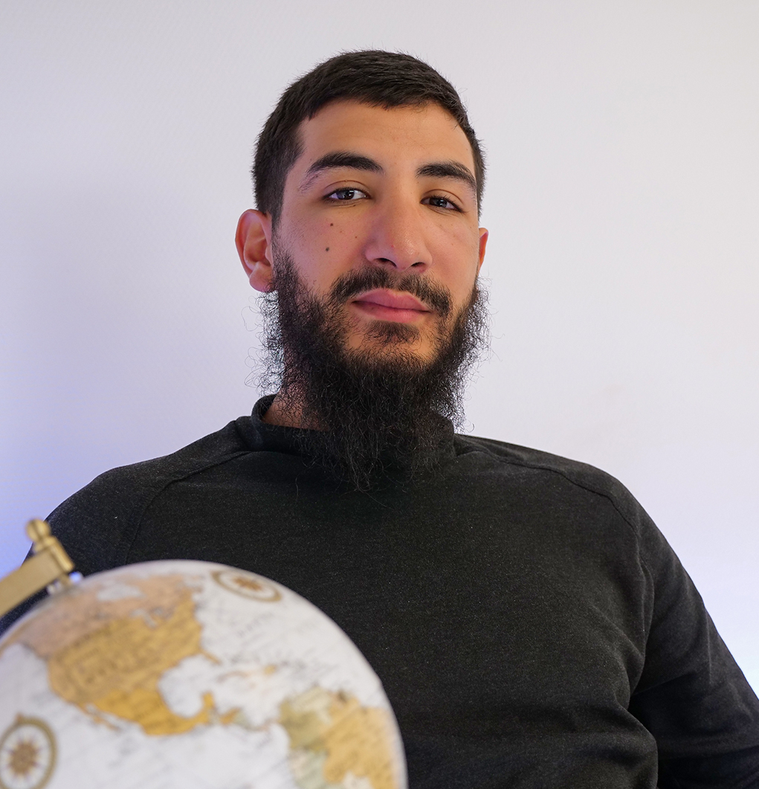

# Bilel Oufkir
## Developpeur web

[Github](https://github.com/Bileloufkir)
[LinkedIn](https://www.linkedin.com/in/bilel-oufkir/)

## Profil
*_______________*

>   Développeur web curieux et methodique.
    En mesure de travailler en équipe, de communiquer efficacement et de m'adapter rapidement aux nouveaux environnements . 
    J'ai une forte éthique de travail et un engagement envers l'excellence dans tout ce que j'entrepprends.
    
## Formation
*_______________*

* **Développeur pgi/ERP**
    >_ALT RH_ / _2022 ( 5 mois )_
    Developper un logiciel en JAVA/JEE
* **Développeur web oriente objet**
    >_Ifocop_ / _Mars 2019 - Nov.2019_
    Développer un site dynamique. 
    Certification RNCP Niveau 6 (bac +3/4) .
* **Développeur intégrateur web**
    >_Ifocop_ / _Nov.2018 - Mars 2019_
    Développer un site statique (Front-end)
    Titre certifié Développeur intégrateur web

## Experience
*_______________*

**Developpeur web** / _Insersite | Juillet 2022 - en cours_

* Formations
* Travail en équipe sur divers projets
* Formations aux bases de Laravel/Python/React
* Rédaction de cahier des charges

## Hobbies
- Jeux video
- Film
- Sport de combat

